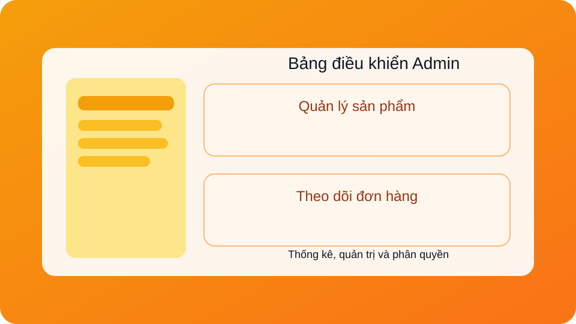
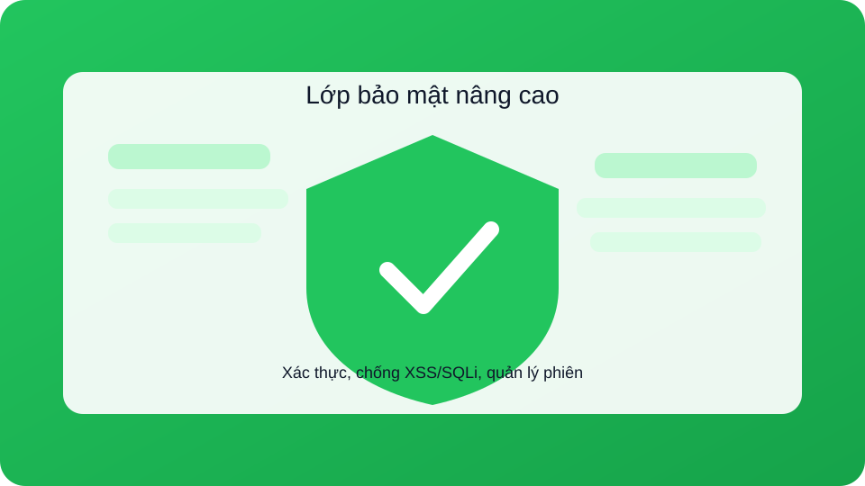

# 🛒 WebSec - Website Bán Hàng Figure

WebSec là website thương mại điện tử bán figure xây dựng bằng PHP/MySQL, tập trung vào trải nghiệm mua sắm và lớp bảo mật nâng cao.

---

## ✨ Tính năng chính

### Dành cho khách hàng
- Đăng ký/đăng nhập tài khoản, xác thực email (tùy chọn SMTP)
- Tìm kiếm và xem chi tiết sản phẩm
- Thêm vào giỏ hàng, thanh toán và theo dõi đơn hàng
- Quản lý tài khoản và đổi mật khẩu

### Dành cho quản trị viên
- Đăng nhập quản trị, quản lý sản phẩm và người dùng
- Theo dõi đơn hàng, doanh số và báo cáo
- Phân quyền, quản lý nội dung hệ thống

### Bảo mật
- Quản lý session an toàn
- Hạn chế XSS/SQLi thông qua helper và middleware
- Chính sách đăng nhập và xác thực nâng cao

---

## 🖼️ Minh họa tính năng

| Trải nghiệm mua sắm | Bảng điều khiển Admin |
| --- | --- |
|  |  |

| Lớp bảo mật nâng cao |
| --- |
|  |

---

## 🧰 Công nghệ sử dụng

- PHP 7.4+ / 8.x
- MySQL/MariaDB 5.7+
- Bootstrap + CSS tùy chỉnh
- PHPMailer (gửi email xác thực)

---

## 🚀 Cài đặt nhanh (Windows/XAMPP)

1. **Cài XAMPP** và bật Apache + MySQL.
2. **Clone source** vào `C:\xampp\htdocs\WebSec` hoặc giải nén ZIP vào thư mục tương tự.
3. **Cài PHPMailer**:
   - `composer install`, hoặc
   - tải thủ công vào `vendor/phpmailer/phpmailer/`.
4. **Tạo database** `store` và **import** file `store.sql`.
5. **Cấu hình DB** trong `connection.php` (user/password phù hợp).
6. **Chạy website** tại: `http://localhost/WebSec/`.

---

## 🔐 Tài khoản mặc định

| Loại | Username | Password | URL |
| --- | --- | --- | --- |
| Admin | `admin` | `admin123` | http://localhost/WebSec/admin_login.php |

> ⚠️ Khuyến nghị đổi mật khẩu admin ngay sau lần đăng nhập đầu tiên.

---

## 🧭 Liên kết nhanh

| Trang | URL |
| --- | --- |
| Trang chủ | http://localhost/WebSec/ |
| Đăng nhập | http://localhost/WebSec/login.php |
| Đăng ký | http://localhost/WebSec/signup.php |
| Admin Panel | http://localhost/WebSec/admin310817.php |

---

## 📂 Cấu trúc thư mục chính

```
WebSec/
├── index.php
├── connection.php
├── store.sql
├── img/
│   └── features/             # Ảnh minh họa tính năng
├── bootstrap/
├── css/
├── SecurityEnhancements.php
├── SecurityHelper.php
└── SessionManager.php
```

---

## 🛠️ Xử lý lỗi thường gặp (tóm tắt)

- **Lỗi kết nối database**: kiểm tra MySQL chạy và thông tin trong `connection.php`.
- **Thiếu bảng**: import lại `store.sql`.
- **Không gửi email**: kiểm tra SMTP trong `.env` và App Password (Gmail).

